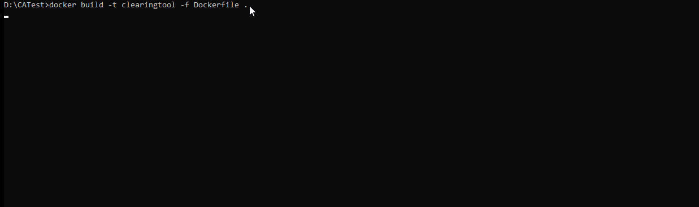
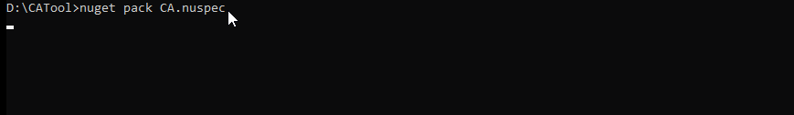

# Introduction 

The Clearing Automation Tool scans and collects the 3rd party OSS components used in a NPM/NuGet/Debian project and uploads it to SW360 and Fossology by accepting respective project ID for license clearing. 
The tool helps the developer/project manager to enable the clearing process faster by reducing the 
manual effort of creating SW360 and FOSSology workflows.

This tool has been  logically split into 3 different executables that enable it to be used as separate modules as per the user's requirement.

**_Note: CA Tool internally uses [Syft](https://github.com/anchore/syft) for component detection for debian type projects._**
 
# Package Installation 

 ### Install from GitHub Release (Official)
#### Use container image

```bash
docker pull ghcr.io/siemens/continuous-clearing:v3.0.0
 ```

#### Use Binary

Download the .nupkg file from [GitHub Releases](https://github.com/siemens/continuous-clearing/releases)

 # Execution via terminal
 
 The Clearing Automation Tool has 3 executables.
 
you can run CATool as container or as a dotnet package,
 
<details>
<summary>Run as container</summary>
 
 Execute them in the following order to achieve the complete License clearing process.

1. **Package Identifier** - This executable takes `package-lock.json` or a `cycloneDX BOM` as input and provides a CycloneDX BOM file as output. For each of the component the availability in jfrog artifactory is identified and added in the BOM file.
 
```text
docker run --rm -it /path/to/InputDirectory:/mnt/Input -v /path/to/OutputDirectory:/mnt/Output -v /path/to/LogDirectory:/var/log -v /path/to/configDirectory:/etc/CATool sw30clearingautomationtool dotnet PackageIdentifier.dll --settingsfilepath /etc/CATool/appSetting.json
 ```
 * Input (i.e., /path/to/InputDirectory -> place to keep input files)
 * Output (i.e.,/path/to/OutputDirectory -> resulted files will be stored here) 
 * Log (i.e., /path/to/logDirectory -> logs will be stored here) 
 * Configuration (i.e., /path/to/ConfigDirectory -> place to keep the Config files i.e **appSetting.json**) 
 
 2. **SW360 Package Creator** - This executable expects the `CycloneDX BOM` as the input, creates the missing components/releases in SW360 and links all the components to the respective project in SW360 portal and triggers the fossology upload.
 
 ```text
 docker run --rm -it /path/to/InputDirectory:/mnt/Input -v /path/to/OutputDirectory:/mnt/Output -v /path/to/LogDirectory:/var/log -v /path/to/configDirectory:/etc/CATool sw30clearingautomationtool dotnet SW360PackageCreator.dll --settingsfilepath /etc/CATool/appSetting.json
```
 3. **Artifactory Uploader** - This executable takes `CycloneDX BOM` which is updated by the ` SW360PackageCreator.dll` as input and uploads the components that are already cleared (clearing state - "Report approved") to the SIPARTY release repo in Jfrog Artifactory.
 ```text
  docker run --rm -it /path/to/InputDirectory:/mnt/Input -v /path/to/OutputDirectory:/mnt/Output -v /path/to/LogDirectory:/var/log -v /path/to/configDirectory:/etc/CATool sw30clearingautomationtool dotnet ArtifactoryUploader.dll --settingsfilepath /etc/CATool/appSetting.json
  ```
</details>

<details>
<summary>Run as dotnet package</summary>
 
 Extract the downloaded .nupkg package , execute the following commands inside the tools folder.

 1. **Package Identifier** - This executable takes `package-lock.json` as input and provides a CycloneDX BOM file as output. For each of the component the availability in jfrog artifactory is identified and added in the BOM file.
 
```text
  PackageIdentifier.exe --settingsfilepath /<Config_Path>/appSetting.json
 ```
 
 2. **SW360 Package Creator** - This executable expects the `CycloneDX BOM` as the input, creates the missing components/releases in SW360 and links all the components to the respective project in SW360 portal and triggers the fossology upload.
 
 ```text
  SW360PackageCreator.exe --settingsfilepath /<Config_Path>/appSetting.json
```
 3. **Artifactory Uploader** - This executable takes `CycloneDX BOM` which is updated by the ` SW360PackageCreator.dll` as input and uploads the components that are already cleared (clearing state - "Report approved") to the SIPARTY release repo in Jfrog Artifactory.
 ```text
   ArtifactoryUploader.exe --settingsfilepath /<Config_Path>/appSetting.json
  ```

</details>


Detailed insight on configuration and execution is provided in [Usage Doc](UsageDoc/CA_UsageDocument.md).
 
 **_Note: ArtifactoryUploader is not applicable for Debian clearing._**

# Development

These instructions will get the project up and running on your local machine for development and testing purposes.

#### Prerequisite

1. Download Visual Studio 2022.
2. Download Docker latest version.
3. Docker image of Clearing Automation tool to be loaded locally.


#### Building via .NET SDK

* Clone the repo in your local directory
* Inside the `src` folder, execute the following command to build the source code :

```bash
dotnet build --configuration Release
 ```
 
#### Creating Docker image

Execute the following command inside the project's root directory where the `Dockerfile` is present to create an image :

```bash
docker build -t <DockerImageName> -f Dockerfile .
 ```
 
 
 #### Creating Dotnet package

Execute the following command inside the project's root directory :

```bash
nuget pack CA.nuspec
 ```
 
 
# Contribute

Improvements are always welcome! Feel free to log a bug, write a suggestion or
contribute code via merge request. To build and test the solution locally you should have .NET Core 6 installed. All details are listed in our contribution guide.
See  [CONTRIBUTING.md](CONTRIBUTING.md).

# License

Code and documentation under [MIT License](LICENSE)


Copyright 2023 Siemens AG
