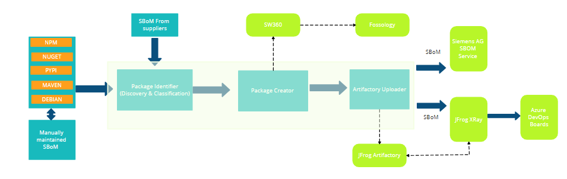

## Continuous Clearing Tool
The Continuous Clearing Tool scans and collects the 3rd party OSS components used in a NPM/NuGet/Maven/Debian/Alpine & Python project and uploads it to SW360 and Fossology by accepting respective project ID for license clearing.

## Continuous Clearing SBOM Tool
BOM generated from the Continuous Clearing Tool will have all the dependencies included in the scanned package , component type, source repo URL, dependency type etc.

## Features

- Creates all dependencies in SW360 and triggers Fossology for license clearing.  
- Provides secured SBOM for legal compliance.
- Standardized machine-readable format of SBOM. 
- Checks for Internal components. 
- Identifies Development dependency components.
- Users can provide their own SBOM file for scanning.

## Supported Ecosystems 
- Javascript (npm)
- Dotnet (nuget)
- Debian
- Alpine
- Maven (jar)
- Python (poetry, requiremens.txt)

## Workflow

## Use Cases:
1. Package identifier Should read all 1st and 3rd components of package type (NPM,NUGET,DEBIAN,ALPINE,PYPI & MAVEN)  
   -   Read SBOM supplied from customer.
   - [ ]         SBOM needs to be in specified CycloneDX format.
   - [ ]     At least all the dependencies should be included in SBOM, further CA Tool needs 
     to add remaining properties.
   - [ ]     SBOM should be Valid & in machine readable format.
   -   Read Source file along with SBOM template if maintained.
   - [ ]        Input files needs to be read according to project type.
   - [ ]    SBOM template reading for static information, manually maintained components and for other details.
   -   Output produced will be in Standardized CycloneDX SBOM format.
   - [ ]      SBOM must be cryptographically secured against tampering.
   - [ ]    All components should be added & classified in SBOM as Internal/External, DevDependent/NONDevDependent, Discovered/manually Added.
      - [ ] All Direct and Transitive dependencies needs to be added.
      - [ ]         Internal/External will be classified from JFrog repository.
      - [ ]      Discovered/manually added will be identified from SBOM template.
       - [ ]              DevDependent or not will be added based on the input files.
         - [ ] 	   For NPM,NUGET & MAVEN will find it from source input files.
         - [ ] 	   For PYPI package type will install poetry for finding Dev components.
         - [ ] 	   For DEBIAN it's not there as of now.
      

2. Package Creator should read SBOM produced from package identifier
    -    Read SBOM for all the components & it's properties
    - [ ]        All component properties FLAG should be read for different use cases.
      - [ ]      DevDependent , Intenal/external & Excluded components logic will be moved from PackageIDentifier to PackageCreator.

   
3. After CATool final execution Standard SBOM should generate & send it for JFrog XRay & Siemens AG SBOM Service

Copyright © Siemens AG ▪ 2025