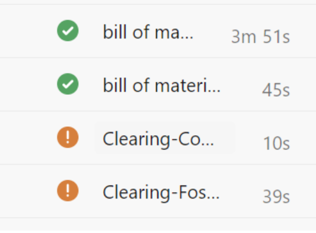

# Continuous Clearing Tool

## Contents
<!--ts-->

* [Introduction](#introduction)

* [Continuous Clearing Tool workflow diagram](#continuous-clearing-tool-workflow-diagram)

* [Prerequisite](#prerequisite)

* [Package Installation](#installation) 

* [Demo Project](#demo-project-after-consuming-the-package)

* [Continuous Clearing Tool Execution](#continuous-clearing-tool-execution)

  * [Overview](#overview)

  * [Prerequisite for execution](#prerequisite-for-continuous-clearing-tool-execution) 

  * [Configuration](#configuring-the-continuous-clearing-tool)

  * [Execution](#continuous-clearing-tool-execution)
  

 * [Continuous Clearing Tool Execution Test Mode](#continuous-clearing-tool-execution-test-mode)

* [Artifactory Uploader Release Execution](#artifactory-uploader-release-execution)

* [How to handle multiple project types in same project](#how-to-handle-multiple-project-types-in-same-project)

* [Templates](#templates)

  * [Azure DevOps](#azure-devops)

* [Troubleshoot](#troubleshoot)

* [Manual Update](#manual-update)

* [Bug or Enhancements](#bug-or-enhancements)

* [Glossary of Terms](#glossary-of-terms)

* [References](#references)

  * [Image References](#image-references)

  * [API References](#api-references)


<!--te-->
# Introduction

The Continuous Clearing Tool helps the Project Manager/Developer to automate the sw360 clearing process of 3rd party components. This tool scans and identifies the third-party components used in a NPM, NUGET, MAVEN, PYTHON, CONAN, Alpine and Debian  projects and makes an entry in SW360, if it is not present. Continuous Clearing Tool links the components to the respective project and creates job for code scan in FOSSology.The output is an SBOM file which has a nested description of software artifact components and metadata.

Continuous Clearing Tool reduces the effort in creating components in SW360 and identifying the matching source codes from the public repository. Tool eliminates the manual error while creating component and identifying correct version of source code from public repository. Continuous Clearing Tool harmonize the creation of 3P components in SW360 by filling necessary information.

# SEPP Integration with Continuous Clearing Tool

The Continuous Clearing Tool incorporates SEPP tool functionalities, seamlessly integrated into the [Artifactory uploader](../usagedocimg/artifactoryuploader.PNG).
This integration ensures
- Software License Clearing is done.
- No pre-release versions of re-use components are used.
- Trace-ability is guaranteed

### What is SEPP tool performing currently ?

* Check for third-party packages in artifactory
* Move internal packages from energy-dev- to energy-release- repos/
* Clone Git repositories.
* Export JSON file for Long term Archiving (LTA-Export)
 
### What are the existing functionalities of Continuous Clearing Tool ?
 
* Check for third party packages
* Identification of correct source code from github
* Creating third party components in SW360
* Triggering source code scan in FOSSology
* Copy cleared third party components from remote repo to SIPARTY release repo.

### Which functionality of SEPP did Continuous Clearing adapt newly ?
 
* Move internal packages from energy-dev-* to energy-release-* repos
* Copy development dependency packages to siparty-devdep-* repos
 
### What happens to SEPP now ?

Currently LTA support is not provided for SBOM, hence until that is implemented SEPP will coexist with continuous clearing tool .Once the implementation is done SEPP will eventually phase out.

# Continuous Clearing Tool workflow diagram

- Package Identifier

   - [NPM/NUGET/MAVEN/PYTHON/CONAN](../usagedocimg/packageIdentifiernpmnuget.PNG)
   - [Debian/Alpine](../usagedocimg/packageIdentifierdebianalpine.PNG)
   - [BasicSBOM](../usagedocimg/PackageIdentifierWithBasicSBOM.png)
- SW360 Package Creator
  - [NPM/NUGET/MAVEN/PYTHON/CONAN](../usagedocimg/packageCreatirnpmnuget.PNG)
  - [Debian](../usagedocimg/packagecreatordebian.PNG)
  - [Alpine](../usagedocimg/ComponentcreaterforAlpine.PNG) 
  
- Artifactory Uploader
  - [NPM/NUGET/MAVEN/PYTHON/CONAN](../usagedocimg/artifactoryuploader.PNG)
 
# Prerequisite

1. **Make an entry for your project in SW360** for license clearance and is **should be in Active state** while running Continuous Clearing Tool


2. **Access request :**

   Get SW360 REST API Authentication token

   > **_1.SW360 token :_**    
   
   > >a) The user can generate a token from their functional account. 

   > >b) The necessary credentials for token generation i.e the client id and client secret.

   >**_2.Artifactory Token :_**

   >>a)For enabling the upload of cleared, internal and development packages into jfrog artifactory, user's need to have their own jfrog artifactory credentials.This includes a username and an Apikey.

   **Pipeline Configuration :**

   For certain  scenarios we have predefined exit codes as mentioned below:

   |Exit Code| Scenario |
   |--|--|
   | 0 | Success |
   | 1 | Critical failure/error in the run |
   | 2 | Action item required from user's side |

   While configuring the Continuous Clearing Tool in the pipeline , user can configure each stage to display the result based on these exit codes. 
   
   This can be done by the configuration management team at the time of modifying the pipeline to support Continuous Clearing Tool.
  
   After the configuration your pipeline will look like this : 
   
   

# Installation   
  ### Use container image 

    docker pull ghcr.io/siemens/continuous-clearing:latest

 ### Nuget package
  
   Download the [.nupkg](https://github.com/siemens/continuous-clearing/releases) file from GitHub releases. 


# Demo project after consuming the package 
 You can find sample yml files under the [DemoProject](../../DemoProject).

# Continuous Clearing Tool Execution

 ### Overview
 
 The Continuous Clearing Tool has 3 dlls, Execute them in the following order to achieve the complete License clearing process.
 
    
   > **1. Package Identifier**
      - Processes the input file and generates CycloneDX BOM file. The input file can be package file or a cycloneDx BOM file generated using the standard tool. If there are multiple input files, it can be processed by just passing the path to the directory in the argument

      **Functionality Without Connections:**
      Provide users the flexibility to generate a basic SBOM even when connections to SW360, JFrog, or both are unavailable. The tool should support limited capabilities in such scenarios, ensuring essential SBOM generation functionality is maintained.      

   >**2. SW360 Package Creator**
      - Process the SBOM file(i.e., output of the first dll) and creates the missing components/releases in SW360 and links all the components to the project in the SW360 portal. This exe also triggers the upload of the components to Fossology and automatically updates the clearing state in SW360.

      `Note : Since the PackageIdentifier generates an SBOM file both Dev dependency and internal components will be existing in the BOM file.Make sure to set `RemoveDevDependency` Flag as true while running this exe`
	  
   >**3. Artifactory Uploader**
      - This processes the CycloneDXBOM file generated by the SW360PackageCreator. It  targets components with an already cleared status (i.e., "Report approved") and facilitates the copy of these components from the remote repository to the "siparty release" repository in JFrog Artifactory. Additionally, it handles the copy of development components from the remote repository to the "siparty devdep" repository. Furthermore, internal packages are moved from the "energy-dev-" repository to the "energy-release-"  repository. Components in states not meeting the above conditions are designated for handling by clearing experts through the Continuous Clearing Dashboard.
      
      `Note: The default setting for the Release flag is False. This flag is present to execute a dry run of the component copy/move operation. This dry run is instrumental in verifying the accuracy of the components' paths and permissions before the actual operation takes place.`

### **Prerequisite for Continuous Clearing Tool execution** 

   - Input files according to project type

      - **Project Type :** **NPM** 

          * Input file repository should contain **package-lock.json** file. If not present do an `npm install`.
          
      
      - **Project Type :** **Nuget**
      
          * .Net core/.Net standard type project's input file repository should contain **project.assets.json** file. If not present do a `dotnet restore`.
          
          * .Net Framework projects, input file repository should contain a **packages.config** file.

      - **Project Type :** **Maven**
      
          * [Apache Maven](https://dlcdn.apache.org/maven/maven-3/3.9.0/binaries/apache-maven-3.9.0-bin.zip) has to be installed in the build machine and added in the `PATH` variable.
		  *Add the cycloneDX Maven Plugin to the main **pom.xml" and run the command to generate the input bom file.
		  
				 mvn install cyclonedx:makeAggregateBom

          * Input file repository should contain **bom.cdx.json** file,Which will be the output of CycloneDx-Maven-Plugin tool

         * **Note** : Incase your project has internal dependencies, compile the project **prior to running the clearing tool**
 
                 mvn clean install -DskipTests=true 

      - **Project Type :** **Python** 

          * Input file repository should contain **poetry.lock** file.
            
          
      - **Project Type :** **Conan** 

          * Input file repository should contain **conan.lock** file. 
		  
    
      - **Project Type :**  **Debian & Alpine** 
       
   	      **Note** : below steps is required only if you have `tar` file to process , otherwise you can keep `CycloneDx.json` file in the InputDirectory.
          *  Create `InputImage` directory for keeping `tar` images and `InputDirectory` for resulted file storing .

          *  Run the command given below by replacing the place holder values (i.e., path to input image directory, path to input directory and file name of the Debian image to be cleared) with actual values.
            
              **Example**:   `docker run --rm -v <path/to/InputImageDirectory>:/tmp/InputImages -v <path/to/InputDirectory>:/tmp/OutputFiles ghcr.io/siemens/continuous-clearing ./syft packages /tmp/InputImages/<fileNameoftheImageTobeCleared.tar> -o cyclonedx-json --file "/tmp/OutputFiles/output.json"`
           
           
             After successful execution, `output.json` (_CycloneDX.json_) file will be created in specified directory
           
             
           
             Resulted `output.json` file will be having the list of installed packages  and the same file will be used as  an input to `Continuous clearing tool - Bom creator` as an argument(`--packagefilepath`). The remaining process is same as other project types.
### **API Calls Retry Strategy**

The retry strategy is implemented using the Polly library to handle transient errors such as HTTP request exceptions, task cancellations, and specific HTTP status codes (5xx server errors and 408 Request Timeout). The policy is configured to retry operations up to three times with increasing intervals between attempts (5, 10, and 30 seconds). This approach ensures that network communication is more resilient and reliable by automatically retrying failed requests due to transient issues.
### **Configuring the Continuous Clearing Tool**

   Arguments can be provided to the tool in two ways :

 #### **Method 1 (Recommended)**
   Copy the below content and create new `appSettings.json` file in `Continuous Clearing tool Config` directory.
   
   Below is the list of settings can be made in `appSettings.json` file.

   _`Sample appSettings.json file`_

 
```
{
  "CaVersion": "",
  "TimeOut": 200,
  "ProjectType": "<Insert ProjectType>",
  "SW360ProjectName": "<Insert SW360 Project Name>",
  "SW360ProjectID": "<Insert SW360 Project Id>",
  "Sw360AuthTokenType": "Bearer",
  "Sw360Token": "<Insert SW360Token in a secure way>",
  "SW360URL": "<Insert SW360URL>",
  "Fossologyurl": "<Insert Fossologyurl>",
  "JFrogApi": "<Insert JFrogApi>",
  "PackageFilePath": "/mnt/Input",
  "BomFolderPath": "/mnt/Output",
  "BomFilePath":"/mnt/Output/<SW360 Project Name>_Bom.cdx.json",
//IdentifierBomFilePath : For multiple project type 
  "IdentifierBomFilePath": "",
//CycloneDxSBomTemplatePath : To be used when customer is providing manual SBOM template
  "CycloneDxSBomTemplatePath": "/PathToSBOMTemplateFile",
  "ArtifactoryUploadApiKey": "<Insert ArtifactoryUploadApiKey in a secure way>",//This should be Jfrog Ref token
  "ArtifactoryUploadUser": "<Insert ArtifactoryUploadUser>",//This should be Jfrog user name and it's Optional
  "RemoveDevDependency": true,
  "EnableFossTrigger": true,
  "Release": false,
  "InternalRepoList": [
    "<Npm Internal Repo Names>", //This should be the internal repo names in JFrog for NPM
    "<Nuget Internal Repo Names>",//This should be the internal repo names in JFrog for Nuget
    "<Maven Internal Repo Names>",//This should be the internal repo names in JFrog for Maven
    "<Python Internal Repo Names>",//This should be the internal repo names in JFrog for Python
  ],
  "Npm": {
    "Include": [ "p*-lock.json" ,"*.cdx.json"],
    "Exclude": [ "node_modules" ],
    "JfrogNpmRepoList": [
      "<Npm Remote Cache Repo Name>",//This is a mirror repo for npm registry in JFrog
      "<Npm Release Repo Name>", //This should be the release repo in JFrog
      "<Npm DevDep Repo Name>" //This should be the development dependency repo in JFrog
    ],
    "JfrogThirdPartyDestRepoName": "<Insert third party NpmDestRepoName>",
    "JfrogInternalDestRepoName": "<Insert Internal NpmDestRepoName>",
    "JfrogDevDestRepoName": "<Insert Dev NpmDestRepoName>",
    "ExcludedComponents": []
  },
  "Nuget": {
    "Include": [ "pack*.config", "p*.assets.json", "*.cdx.json" ],
    "Exclude": [],
    "JfrogNugetRepoList": [
      "<Nuget Remote Cache Repo Name>",//This is a mirror repo for nuget.org in JFrog
      "<Nuget Release Repo Name>",//This should be the release repo in JFrog
      "<Nuget DevDep Repo Name>" //This should be the development dependency repo in JFrog
    ],
    "JfrogThirdPartyDestRepoName": "<Insert third party NugetDestRepoName>",
    "JfrogInternalDestRepoName": "<Insert Internal NugetDestRepoName>",
    "JfrogDevDestRepoName": "<Insert Dev NugetDestRepoName>",
    "ExcludedComponents": []
  },
  "Maven": {
    "Include": [ "*.cdx.json" ],
    "Exclude": [],
    "JfrogMavenRepoList": [
      "<Maven Remote Cache Repo Name>",//This is a mirror repo for repo.maven in JFrog
      "<Maven Release Repo Name>",//This should be the release repo.maven in JFrog
      "<Maven DevDep Repo Name>" //This should be the development dependency repo in JFrog
    ],
    "JfrogThirdPartyDestRepoName": "<Insert third party MavenDestRepoName>",
    "JfrogInternalDestRepoName": "<Insert Internal MavenDestRepoName>",
    "JfrogDevDestRepoName": "<Insert Dev MavenDestRepoName>",
    "ExcludedComponents": []
  },
  "Debian": {
    "Include": [ "*.json" ],
    "Exclude": [],
    "ExcludedComponents": []
  },
  "Alpine": {
    "Include": [ "*.json" ],
    "Exclude": [],
    "ExcludedComponents": []
  },
  "Python": {
    "Include": [ "poetry.lock", "*.cdx.json" ],
    "Exclude": [],
    "JfrogPythonRepoList": [
      "<Python Remote Cache Repo Name>",
      "<Python Release Repo Name>",//This should be the release repo in JFrog
      "<Python DevDep Repo Name>" //This should be the development dependency repo in JFrog
    ],
    "JfrogThirdPartyDestRepoName": "<Insert third party PythonDestRepoName>",
    "JfrogInternalDestRepoName": "<Insert Internal PythonDestRepoName>",
    "JfrogDevDestRepoName": "<Insert Dev PythonDestRepoName>",
    "ExcludedComponents": []
  },
  "Conan": {
    "Include": [ "conan.lock"],
    "Exclude": [],
	"JfrogConanRepoList": [
      "<Conan Remote Cache Repo Name>",
      "<Conan Release Repo Name>",
      "<Conan DevDep Repo Name>" //This should be the development dependency repo in JFrog
    ],
    "JfrogThirdPartyDestRepoName": "<Insert third party ConanDestRepoName>",
    "JfrogInternalDestRepoName": "<Insert Internal ConanDestRepoName>",
    "JfrogDevDestRepoName": "<Insert Dev ConanDestRepoName>",
    "ExcludedComponents": []
  }
  
}
```

Description for the settings in `appSettings.json` file

|S.No| Argument name   |Description  | Is it Mandatory    | Example |
|--|--|--|--|--|
| 1 |--packagefilepath   | Path to the package-lock.json file or to the directory where the project is present in case we have multiple package-lock.json files.                                      |Yes ,For Docker run /mnt/Input | D:\Clearing Automation |
| 2 |--cylonedxsbomtemplatepath | Path to the SBOM cycloneDx BOM file. Can be passed along with packagefilepath.                           |No if the first argument is provided| D:\ExternalToolOutput|
| 3 |--bomfolderpath | Path to keep the generated boms  |  Yes , For Docker run /mnt/Output    | D:\Clearing Automation\BOM
|  4| --sw360token  |  SW360 Auth Token |  Yes| Refer the SW360 Doc [here](https://www.eclipse.org/sw360/docs/development/restapi/access).Make sure you pass this credential in a secured way. |
| 5 | --sw360projectid |  Project ID from SW360 project URL of the project  |  Yes| Obtained from SW360 |
|  6|  --projecttype    | Type of the package         | Yes |  NPM/NUGET/Debian/MAVEN/Alpine |
|7 | --removedevdependency  |  Make this field to `true` , if Dev dependencies needs to be excluded from clearing |  Optional ( By default set to true) | true/false |
| 8|  --sw360url  |  SW360 URL              |Yes |  https://<my_sw360_server>|
|  9| --sw360authtokentype   |  SW360 Auth Token  |Yes  | Token/Bearer |
|10  |  --settingsfilepath |  appSettings.json file path                                                                                                                             |Optional (By default it will take from the  bom creator exe location     |  |
|  11|  --artifactoryuploadapikey  | JFrog Auth Token          |  Yes| Generated from Jfrog Artifactory.Make sure you pass this credential in a secured way. |
|  12|  --bomfilepath  | CycloneDX BOM Filepath (output generated from the previous Package Identifier run) i.e The file path of the *_Bom.cdx.json file         |  Yes| For SW360PackageCreator & ArtifactoryUploader run needs to provide this path. |
|  13|  --identifierbomfilepath  | CycloneDX BOM Filepath (output generated from the previous Package Identifier run,applicable only if there are multiple project types) i.e The file path of the *_Bom.cdx.json file         |  No| If there are multiple project type this argument can be used. |
|  14|  --logfolderpath | Path to create log        |  No| If user wants to give configurable log path this parameter is used |
| 15   | --fossologyurl | Fossology URL                                                                                                                                        | Yes |      https://<my_fossology_server>                                                                                                                     | Yes                      |                                                                                                                          | Optional (By default it will take from the  Package Creator exe location     |                                                    |
| 16    | --artifactoryuploaduser              | Jfrog User Email                              | Yes                                                       |
|17  |  --release |  Artifactory Uploader release mode                                                                                                                             |Optional (By default it will be set to False)     |  |
| 18  | --npm:jfrogthirdpartydestreponame         | The destination folder name for the cleared NPM package to be copied to                  | Yes                                                       |
| 19  | --npm:jfroginternaldestreponame         | The destination folder name for the internal NPM package to be moved to                  | Yes                                                    |
| 20  | --npm:jfrogdevdestreponame         | The destination folder name for the development NPM package to be copied to                  | Yes                                                    |
| 21  | --nuget:jfrogthirdpartydestreponame         | The destination folder name for the cleared Nuget package to be copied to                  | Yes                                                    |
| 22  | --nuget:jfroginternaldestreponame         | The destination folder name for the internal Nuget package to be moved to                  | Yes                                                    |
| 23  | --nuget:jfrogdevdestreponame         | The destination folder name for the development Nuget package to be copied to                  | Yes                                                    |
| 24  | --maven:jfrogthirdpartydestreponame         | The destination folder name for the cleared Maven package to be copied to                  | Yes                                                    |
| 25  | --maven:jfroginternaldestreponame         | The destination folder name for the internal Maven package to be moved to                  | Yes                                                    |
| 26  | --maven:jfrogdevdestreponame         | The destination folder name for the development Maven package to be copied to                  | Yes                                                    |
| 27  | --python:jfrogthirdpartydestreponame         | The destination folder name for the cleared Python package to be copied to                  | Yes                                                    |
| 28  | --python:jfroginternaldestreponame         | The destination folder name for the internal Python package to be moved to                  | Yes                                                    |
| 29  | --python:jfrogdevdestreponame         | The destination folder name for the development Python package to be copied to                  | Yes                                                    |
| 30  | --conan:jfrogthirdpartydestreponame         | The destination folder name for the cleared Conan package to be copied to                  | Yes                                                    |
| 31  | --conan:jfroginternaldestreponame         | The destination folder name for the internal Conan package to be moved to                  | Yes                                                    |
| 32  | --conan:jfrogdevdestreponame         | The destination folder name for the development Conan package to be copied to                  | Yes                                                    |
| 33   | --timeout          | SW360 response timeout value                  | No                                                       |                                                |

 #### **Method 2**

You can also pass the above mentioned arguments in the command line.

`Note: If the second approach is followed then make sure you provide all the settings mentioned in the appsettings.json in the command line`
  
  #### Exclude  Component or Folders :
  In order to exclude any components ,it can be configured in the  "appSettings.json" by providing the package name and version as specified above in the *_ExcludedComponents_* field.
  
  Incase if you want to exclude a single component of the format _"@group/componentname"_ `eg : @angular/common` specify it as _"@group/componentname:version"_ i.e `@angular/common:4.2.6`

  If multiple versions has to be excluded of the same component, specify it as _"@group/componentname:*"_ i.e `@angular/common:*`
  If multiple Component has to be excluded along with version, specify it as _"@group/componentname*:*"_ i.e `@angular/comm*:*`
  
  In order to **Exclude specific folders** from the execution, It can be specified under the **Exclude section** of that specific **package type**.


### **Continuous Clearing Tool Execution** 

Continuous Clearing Tool can be executed as container or as binaries,

  <details>
  <summary>Docker run</summary>

   ### Prerequisite
   1. Install Docker (Latest stable version).
   2.  Create local directories for mapping to the Continuous clearing tool container directories
        - Input  : Place to keep input files.
        - Output : Resulted files will be stored here.
        - Log    : Continuous clearing log files.
        - CAConfig :  Place to keep Config files i.e., `appSettings.json`.


  **Note** : It is not recommended to use `Primary drive(Ex C:\)` for project execution or directory creation and also the `drive` should be configured as `Shared Drives` in docker.

### Package Identifier

  - In order to run the PackageIdentifier.dll , execute the below command.

    **Example** : `docker run --rm -it -v /path/to/InputDirectory:/mnt/Input -v /path/to/OutputDirectory:/mnt/Output -v /path/to/LogDirectory:/var/log -v /path/to/configDirectory:/etc/CATool ghcr.io/siemens/continuous-clearing dotnet PackageIdentifier.dll --settingsfilepath /etc/CATool/appSettings.json`


### SW360 Package Creator

  - In order to run the SW360PackageCreator.dll , execute the below command. 

    **Example** : `docker run --rm -it -v /path/to/OutputDirectory:/mnt/Output -v /path/to/LogDirectory:/var/log -v /path/to/configDirectory:/etc/CATool ghcr.io/siemens/continuous-clearing dotnet SW360PackageCreator.dll --settingsfilepath /etc/CATool/appSettings.json`

###  Artifactory Uploader

  * Artifactory uploader is **_`not applicable for Debian and Alpine  type package`_** clearance.

  *  In order to run the Artifactory Uploader dll , execute the below command.
  
     **Example** : `docker run --rm -it -v /path/to/OutputDirectory:/mnt/Output -v /path/to/LogDirectory:/var/log -v /path/to/configDirectory:/etc/CATool ghcr.io/siemens/continuous-clearing dotnet ArtifactoryUploader.dll --settingsfilepath /etc/CATool/appSettings.json`

</details>

<details>
<summary>Binary execution</summary>

### Prerequisite
1. .NET 8 runtime [https://dotnet.microsoft.com/download/dotnet-core/8.0](https://dotnet.microsoft.com/en-us/download/dotnet/8.0)
2. Node.js and Git latest


 ### Package Identifier

  - In order to run the PackageIdentifier.exe, execute the below command.

    **Example** : `PackageIdentifier.exe --settingsfilepath /<PathToConfig>/appSettings.json`

### SW360 Package Creator

  - In order to run the SW360PackageCreator.exe, execute the below command. 

    **Example** : `SW360PackageCreator.exe --settingsfilepath /<PathToConfig>/appSettings.json`

###  Artifactory Uploader

  * Artifactory uploader is **_`not applicable for Debian and Alpine  type package`_** clearance.

  *  In order to run the Artifactory Uploader exe, execute the below command.
  
     **Example** : `ArtifactoryUploader.exe --settingsfilepath /<PathToConfig>/appSettings.json`
</details>

# Continuous Clearing Tool Execution Test Mode

  The purpose the test mode execution of the tool is to ensure that there are no any connectivity issues with SW360 server.
  
  - In order to execute the tool in test mode we need to pass an extra parameter to the existing 
argument list.
    
    **Example** : `docker run --rm -it -v /D/Projects/Output:/mnt/Output -v /D/Projects/DockerLog:/var/log -v /D/Projects/CAConfig:/etc/CATool ghcr.io/siemens/continuous-clearing dotnet SW360PackageCreator.dll --settingsfilepath /etc/CATool/appSettings.json --mode test`

    or

    **Example** : `SW360PackageCreator.exe --settingsfilepath /<PathToConfig>/appSettings.json --mode test`

# Artifactory Uploader Release Execution

  By default, the release mode is set to `False`. This configuration is designed for the routine execution of the Artifactory uploader on a daily basis during the project's development phase. The primary objective is to continuously verify the accuracy of component paths and permissions before actual operations.
  When the release mode is set to `True`, it indicates a shift towards deployment in a production environment. In this mode, the Artifactory uploader is prepared for live operations, signaling the transition from the verification stage to the actual copy/move of components.
  
  - In order to execute the tool in release mode we need to pass an extra parameter to the existing 
argument list.
    
    **Example** : `docker run --rm -it -v /D/Projects/Output:/mnt/Output -v /D/Projects/DockerLog:/var/log -v /D/Projects/CAConfig:/etc/CATool ghcr.io/siemens/continuous-clearing dotnet ArtifactoryUploader.dll --settingsfilepath /etc/CATool/appSettings.json --release true`

    or

    **Example** : `ArtifactoryUploader.exe --settingsfilepath /<PathToConfig>/appSettings.json --release true`

# How to handle multiple project types in same project

Incase your project has both NPM/Nuget components it can be handled by merely running then `Package Identifier dll` twice.
### Steps for Execution:
1. Run the `Package Identifier dll` with "**ProjectType**" set as "**NPM**" in `appSettings.json` .

2. A cycloneDX  BOM will be generated in the output BOM path that you provide in the argument.
3. Next run the `Package Identifier dll` with "**ProjectType**" set as "**NUGET**". In this run make sure that along with the usual arguments you also provide and additional argument "**--identifierBomFilePath**" which will contain the comparison BOM file path which is generated in the previous run.

4. Once this is done after the dll run you can find that the components from the first run for "**NPM**" and the components from second run for "**NUGET**" will be merged into one BOM file

# Templates

## Azure DevOps

Sample templates for integrating the Continuous Clearing Tool (CCTool) workflow in Azure Pipelines can be found at `templates\azureDevops`.  
For more details on Azure DevOps templates, refer to the official [Microsoft Documentation](https://learn.microsoft.com/en-us/azure/devops/pipelines/process/templates?view=azure-devops&pivots=templates-includes).

### **Advantages of Running CA Tool via Templates**
- **Simplified Setup:** Avoids adding manual steps for different CCTool stages.
- **Consistency and Standardization:** Ensures uniform execution across the organization.
- **Automated File Uploads:** Handles uploading of logs and BOM files after execution.

---

## Integration

1. **Check-in Templates:** Commit the templates into an Azure DevOps repository.  
2. **Reference the Repository:** Include the repository in a new pipeline as shown below:

```yaml
resources:
  repositories:
  - repository: Templates_Pipeline
    type: git
    name: YourProject/Templates_Pipeline
```
:point_right: Note: If the Appsettingsfilepath parameter is not passed, the sample default app settings file is used by the template.

The sample default app settings file is located at `templates\sample-default-app-settings.json` and can be customized as needed.

### Add a New Template Calling Step

#### NuGet Template Example

```yaml
- template: pipeline-template-step-install-run-cctool-nuget.yml@Templates_Pipeline
          parameters:
                sw360url: '$(sw360url)'
                sw360token: '$(sw360token)'
                sw360projectID: '$(sw360projectID)'
                sw360projectName: '$(sw360projectName)' 
                Sw360AuthTokenType: '$(Sw360AuthTokenType)'
                projecttype: '$(projecttype)'
                Artifactorytoken: '$(ARTIFACTORYAPIKEY)'
                packageFilePath: '$(packageFilePath)'
                BomFolderPath: '$(BomFolderPath)'
                bomFilePath: '$(BomFolderPath)/$(sw360projectName)_Bom.cdx.json'
```

#### Debian Template Example

```yaml
- template: pipeline-template-step-install-run-cctool-docker.yml@Templates_Pipeline
          parameters:
                sw360url: '$(sw360url)'
                sw360token: '$(sw360token)'
                sw360projectID: '$(sw360projectID)'
                sw360projectName: '$(sw360projectName)' 
                Sw360AuthTokenType: '$(Sw360AuthTokenType)'
                projecttype: '$(projecttype)'
                Artifactorytoken: '$(ARTIFACTORYAPIKEY)'
                packageFilePath: '$(packageFilePath)'
                BomFolderPath: '$(BomFolderPath)'
                bomFilePath: '$(BomFolderPath)/$(sw360projectName)_Bom.cdx.json'
```

### Paramters
| Name | Description |
|--|--|
| `Appsettingsfilepath`| Add the appSetting.json file path |
| `sw360url`| Provide the Sw360 URL |
| `sw360token`| Provide the Sw360 Token|
| `sw360projectID` | Provide the Sw360 ProjectID which you're going to make an entry in Sw360|
|`sw360projectName`|Provide the Sw360 Project Name|
|`Sw360AuthTokenType`|Add the Sw360 tokentype either **Token or Bearer**|
|`projecttype`|Package type NPM/NUGET/DEBIAN/MAVEN/PYTHON|
|`Artifactorytoken`|JFrog Artifatory token|
|`packageFilePath`|Path where the input files resides|
|`BomFolderPath`|Path for creating BOM's files after the run of CCTool|

# Troubleshoot
1. In case your pipeline takes a lot of time to run(more than 1 hour) when there are many components. It is advisable to increase the pipeline timeout and set it to a minimum of 1 hr.

1. In case of any failures in the pipeline, while running the tool,check the following configurations.
   * Make sure your build agents are running.
   * Check if there are any action items to be handled from the user's end.(In this case the exit code with which the pipeline will fail is **2**)

   * Check if the proxy settings environment variables for sw360 is rightly configured in the build machine.


# Manual Update
Upload attachment manually for [Debian](Manual-attachment-Debian-Overview.md) type.


# Bug or Enhancements

For reporting any bug or enhancement and for your feedbacks click [here](https://github.com/siemens/continuous-clearing/issues)
 

# Glossary of Terms

| **3P Components** | **3rd Party Components**  |
|-------------------|---------------------------|
| BOM               | Bill of Material          |
| apiAuthToken      | SW360 authorization token |

# References
 ## Image References
- Fetching Project Id from SW360


## API References 

- SW360 API Guide : [https://www.eclipse.org/sw360/docs/development/restapi/dev-rest-api/](https://www.eclipse.org/sw360/docs/development/restapi/dev-rest-api/)
- FOSSology API Guide: [https://www.fossology.org/get-started/basic-rest-api-calls/](https://www.fossology.org/get-started/basic-rest-api-calls/)

Copyright © Siemens AG ▪ 2024
