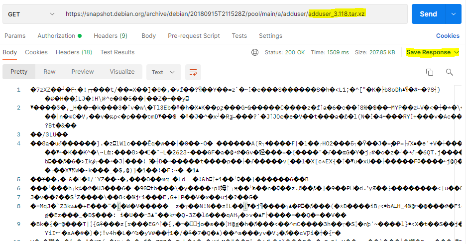
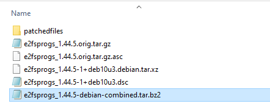

# Manual Update
   
## How to Download the source code manually for Debian components :
  In case if the CA Tool failed to upload the source code for any component following steps need to be done to update them manually.
       
-    Get Source name and version details of the components to upload.
-    Make a Get request with the name and version details of the component/release.
     
```
https://snapshot.debian.org/package/<SourceName>/<Version>/

Ex: https://snapshot.debian.org/package/adduser/3.118/
```


-    **If the response contains only the source file and dsc file** , click on the source file (i.e., ends with .tar.xz/.tar.gz) and save it with the correct file name`(Ex: adduser_3.118.tar.xz).`



  **Note**: `Postman` can be used for downloading the source code.

-  Attach the downloaded source file to the release in SW360.

-   **If the response contains both the Original (`*orig.tar.**`) and Debian patch files `(*debian.tar.**)`** , a patch needs to be applied to get the correct source file,


  **Note** : Select the files under `Seen in debian` section first ,if not available go for other sections.

-  Open the `.dsc file (Ex: e2fsprogs_1.44.5-1+deb10u3.dsc)` and look for the `Files` section and download all the files specified in that section.


 
-  Keep all the downloaded files in one folder along with `.dsc` file for applying the patch.

- To apply patch, execute the command given below in Linux environment. 

` dpkg-source -x <filename.dsc> patchedfiles`

`Ex: dpkg-source -x e2fsprogs_1.44.5-1+deb10u3.dsc patchedfiles`


-  After the successful execution of the command, patched files will be created inside the `patchedfiles` folder. ZIP the `patchedfiles` folder and rename it as `<source_Name>_<version><-debian-combined.tar.bz2>`(
i.e., shown in snapshot given below)



-  Attach  the `<source_Name>_<version><-debian-combined.tar.bz2>` file as SRC under the attachment section for the release in SW360.
